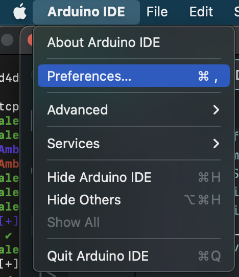
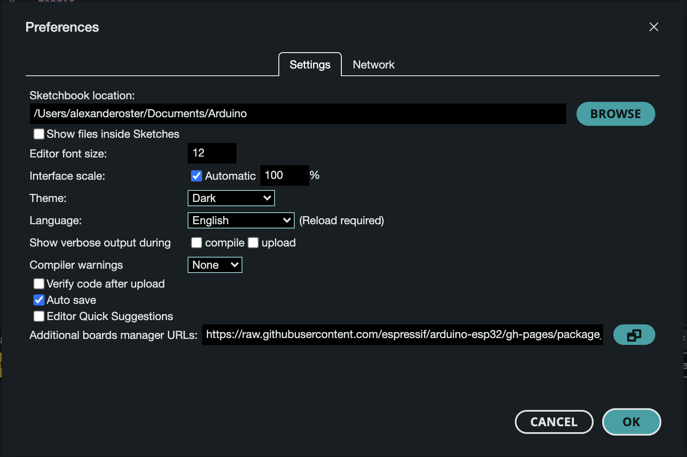
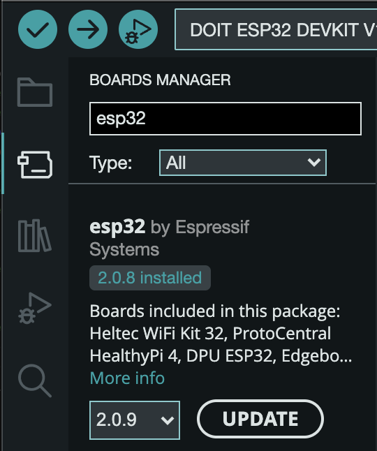
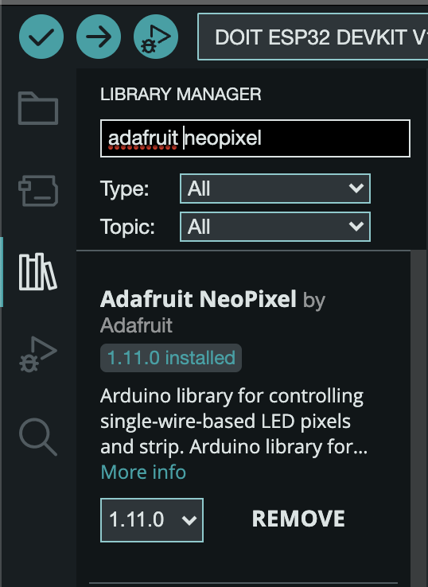
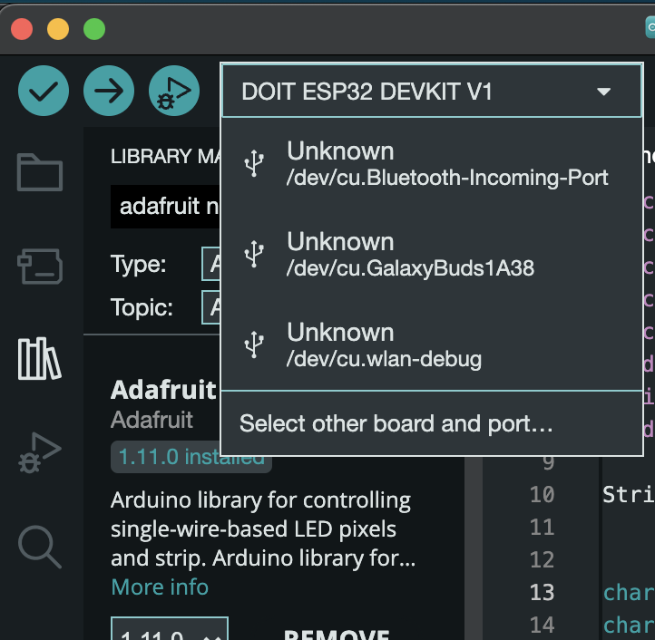
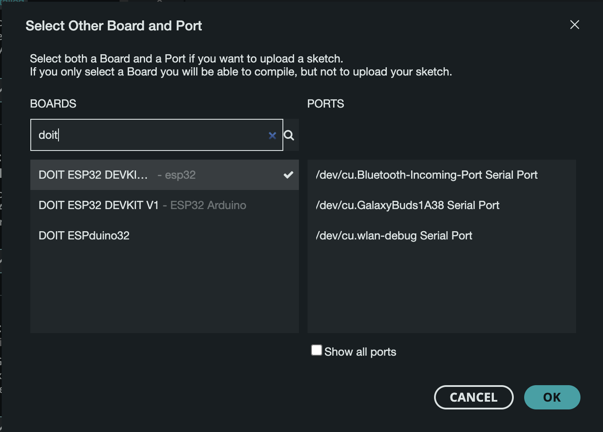
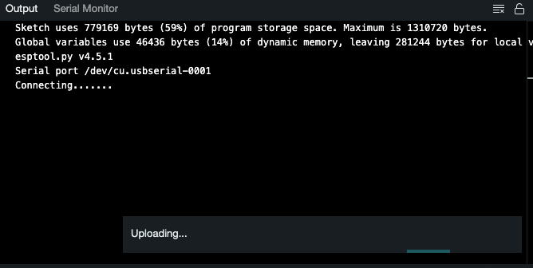
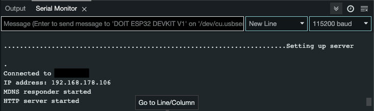
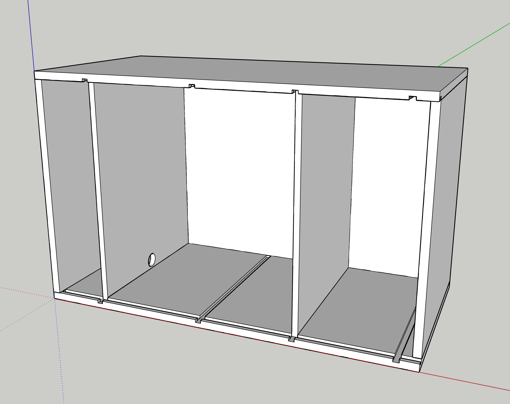

- [Hardware](#hardware)
- [Setup](#setup)
- [Workflow](#workflow)
- [API](#api)
- [Additional Resources](#additional-resources)

# Hardware

DoIt Esp32 Board
25 RGB LED Strip with WS2812B LED´s

# Setup

Arduino IDE https://www.arduino.cc/en/software

## Install Esp32 Driver

In Arduino IDE go to `Preferences`

Add `https://raw.githubusercontent.com/espressif/arduino-esp32/gh-pages/package_esp32_index.json` to `Additional boards manager URLs`

Go to Boards Manager, search for `esp32` and install it.

On Windows add additional driver from `https://www.silabs.com/developers/usb-to-uart-bridge-vcp-drivers?tab=downloads`; download and install as known. Not needed for Mac.

## NeoPixel Library 

To control the lights we need the Neopixel library.

Go to the Library Manager and search for `adafruit neopixel` and install it.

## Connect the Board

To connect to your board go to the `select board and port` dropdown and then on `Select other board and port...`

Search for `doit` in the Boards search field, select the Devkit one without Arduino suffix and selecte a Port. If you can not determine which port is the right one try one after another, just repeat this steps with another port.

Now you should be ready to compile and upload code to your esp32

# Workflow

Open Project 'light_controller.ino' in Arduino SDK

Change SSID and Password to your network

	const char* ssid = "";
	const char* password = "";

Upload to Esp32
    Press Boot Button on Esp32 when compilation finishes and uploading beginns, in console output it starts connecting at this moment

After successful upload, open Serial Monitor to get IP-Address of Esp32

Set IP-Address in Android Ui-Test

# Api

### Info

endpoint `IP/info` returns the current software version

### Brightness

endpoint `IP/brightness` query Parameter `brightness` changes the brightness value; Values in 0 and 255 are allowed

### Color

endpoint `IP/color` query Parameters `red`, `green` and `blue` changes the color; Values in 0 and 255 are allowed; All paramters are mandatory

# Additional Resources

- [Postman collection](Light_Controller.postman_collection.json)
- [Wood Parts List](wood_part_list.md)
- [Sketchup 3D Model](3D_Model_SketchUp.skp)

